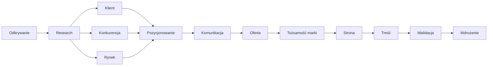

# Brand Strategy OS

> **System operacyjny stratega marki.** Nie encyklopedia o brandingu — baza decyzji, procesów i metodologii, która pozwala LLM-owi (i człowiekowi) *wykonać cały proces strategiczny* zamiast tylko odpowiadać na pytania.

---

## Z czym pracujesz

| Dokument | Co to jest | Kiedy czytać |
|---|---|---|
| [[01 Jak myśli strateg marki]] | Sposób myślenia, analizy i podejmowania decyzji stratega | **Zawsze — pierwszy dokument** |
| [[02 Zasady]] | 5 zasad porządkujących całą bazę wiedzy | Przy tworzeniu/zmianie treści |
| [[03 Jak korzystać z OS]] | Ścieżka: wiedza → procedura → rezultat | Przed każdą pracą z OS |

## Proces (Playbooki)

Proces zbudowany jest tak, jak pracuje strateg. Każdy playbook odpowiada etapowi procesu.

1. [[Playbooki/01 Odkrywanie|01 Odkrywanie]]
2. [[Playbooki/02 Research|02 Research]]
3. [[Playbooki/03 Klient|03 Klient]]
4. [[Playbooki/04 Konkurencja|04 Konkurencja]]
5. [[Playbooki/05 Rynek|05 Rynek]]
6. [[Playbooki/06 Pozycjonowanie|06 Pozycjonowanie]]
7. [[Playbooki/07 Komunikacja|07 Komunikacja]]
8. [[Playbooki/08 Oferta|08 Oferta]]
9. [[Playbooki/09 Tożsamość marki|09 Tożsamość marki]]
10. [[Playbooki/10 Strona|10 Strona]]
11. [[Playbooki/11 Treść|11 Treść]]
12. [[Playbooki/12 Walidacja|12 Walidacja]]
13. [[Playbooki/13 Wdrożenie|13 Wdrożenie]]

## Biblioteki

- **Frameworki/** — karty metodologii (każda odpowiada na te same 9 pytań). *Tu wybierasz narzędzia.* → [[Frameworki/Frameworki|Frameworki]]
- **Wiedza/** — fundamenty dziedzinowe: psychologia, copywriting, UX, design, marketing. → [[Wiedza/Wiedza|Wiedza]]
- **Szablony/** — szablony artefaktów (persona, pozycjonowanie, StoryBrand, oferta, struktura strony...). → [[Szablony/Szablony|Szablony]]
- **Prompty/** — prompty do uruchamiania agenta (master prompt + prompty etapowe). → [[Prompty/Prompty|Prompty]]
- **Checklisty/** — listy weryfikacyjne (wdrożenie, jakość strategii). → [[Checklisty/Checklisty|Checklisty]]
- **Przykłady/** — kompletne, przykładowe strategie pokazujące proces w akcji. → [[Przykłady/Przykłady|Przykłady]]

---

## Najszybszy sposób startu

Dla nowego zlecenia (np. „strategia dla kancelarii podatkowej") wykonaj:

1. Przeczytaj [[01 Jak myśli strateg marki]] i [[03 Jak korzystać z OS]].
2. Użyj master prompta: [[Prompty/Master prompt strategia|Master prompt]].
3. Przejdź przez [[Playbooki/00 Jak korzystać z procesu|proces]] etap 01 → 13, za każdym razem wybierając frameworki z [[Frameworki/Frameworki|biblioteki frameworków]].
4. Zweryfikuj wynik checklistą: [[Checklisty/Checklista jakości strategii|Checklista jakości]].

---

## Mapa wiedzy

