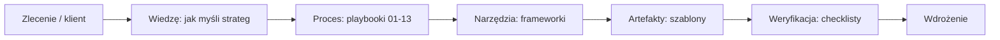

# Jak korzystać z OS

*Ścieżka, którą agent przechodzi od zlecenia do kompletnej strategii. Model: **wiedza → procedura → rezultat**.*

---

## Model działania

## Co się dzieje, gdy pojawia się zlecenie

Użytkownik wpisuje np. **„Strategia dla kancelarii podatkowej"**.

Agent (człowiek lub LLM) powinien:
1. Przeczytać [[01 Jak myśli strateg marki]] — wejść w rolę stratega.
2. Ustalić **czego brakuje** (jakie dane niezbędne do dobrej decyzji nie są znane).
3. Zapytać o brakujące informacje lub zaplanować research.
4. Przejdź etapy procesu [[Playbooki/00 Jak korzystać z procesu|01 → 13]], wybierając frameworki z biblioteki [[Frameworki/Frameworki|Frameworki]].
5. Wypełnij artefakty szablonami z [[Szablony/Szablony|Szablony]].
6. Zweryfikuj jakość [[Checklisty/Checklista jakości strategii|checklistą jakości]].
7. Podać [[Checklisty/Checklista wdrożenia|checklistę wdrożenia]].

## Role w OS

| Rola | Gdzie | Przykład |
|---|---|---|
| **Wiedza** (fundamenty) | [[Wiedza/Wiedza|Wiedza]] | „jak działa psychologia decyzji?" |
| **Proces** (kolejność) | [[Playbooki/00 Jak korzystać z procesu|Playbooki]] | „jak zrobić research krok po kroku?" |
| **Narzędzia** (frameworki) | [[Frameworki/Frameworki|Frameworki]] | „czym połączyć pozycjonowanie z komunikacją?" |
| **Artefakty** (szablony) | [[Szablony/Szablony|Szablony]] | „stworzysz mi personę?" |
| **Start agenta** (prompty) | [[Prompty/Prompty|Prompty]] | „jak uruchomić cały proces?" |
| **Jakość** (checklisty) | [[Checklisty/Checklisty|Checklisty]] | „czy strategia jest kompletna?" |
| **Dowód** (przykłady) | [[Przykłady/Przykłady|Przykłady]] | „pokaż przykład strategii dla usług B2B" |

## Zasady pracy z OS

1. **Zawsze zaczynaj od sposobu myślenia**, nie od frameworka. Framework bez myślenia = dekoracja.
2. **Dokumenty mówią, kiedy używać, a kiedy nie.** Czytaj całą kartę frameworka, nie tylko „co to jest".
3. **Waliduj zanim ogłosisz sukces.** Strategia bez testu to hipoteza.
4. **Nie odwzorowuj swojej opinii jako faktu.** Jeśli coś jest Twoją opinią — oznacz to jako hipotezę i zaplanuj sprawdzenie.
5. **Używaj języka klienta.** Komunikacja i stronę buduje się słowami klienta, nie terminami z podręcznika.

## Kolejność czytania przy nowym projekcie

1. [[01 Jak myśli strateg marki]]
2. [[03 Jak korzystać z OS]] (ten dokument)
3. [[Playbooki/00 Jak korzystać z procesu]]
4. Master prompt: [[Prompty/Master prompt strategia]]
5. Dla każdego etapu: odpowiedni [[Playbooki/00 Jak korzystać z procesu|playbook]] + dobrane [[Frameworki/Frameworki|frameworki]]
6. Na końcu: [[Checklisty/Checklista jakości strategii]] + [[Checklisty/Checklista wdrożenia]]
